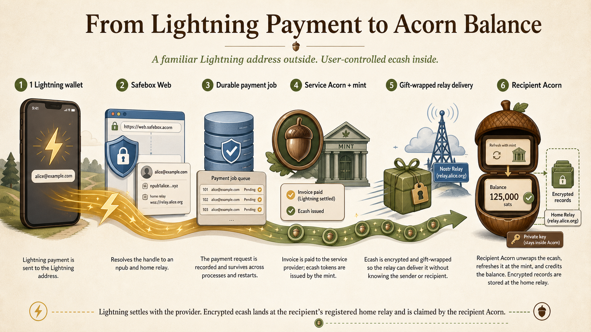

# Safebox Web

Safebox Web is a minimal FastAPI interface for the installable
[Safebox Acorn](https://github.com/trbouma/safebox-acorn) component.

The user-facing project site is built with MkDocs in
[`website/`](website/index.md).

The browser interface follows a documented
[server-rendered hypermedia architecture](docs/HYPERMEDIA-ARCHITECTURE.md).
Application and wallet logic remains in FastAPI and Acorn; browser JavaScript
is limited to progressive presentation behavior and narrowly scoped device
input such as QR acquisition.

Informational fiat estimates use a database-backed cache refreshed by the
singleton worker; web requests do not contact the external rate provider. See
the [Informational Currency Rate Cache](docs/CURRENCY-RATE-CACHE.md) for process,
failure, freshness, privacy, and configuration boundaries.
The same cache supplies the unauthenticated public `/rates` page. Public access
does not weaken the normal HTTPS transport requirement.
The companion
[Progressive Web App and Hypermedia Boundary](docs/PWA-HYPERMEDIA-BOUNDARY.md)
defines how future installability, offline presentation, service workers,
notifications, NFC, and local browser conveniences can be introduced without
moving workflow authority or Acorn state into the browser.

A first read-only OpenETR integration now projects the signed origin and linked
control-event history for an existing Original Record. The initial adapter
implements only kinds `1415` and `1416`, the object-wide `o` query, exact
prior-event `e` traversal, and signature validation; it does not import OpenETR
or publish events. Future issuance and fuller independent verification remain
scoped by the
[OpenETR Issue and Verify Integration Design Note](docs/OPENETR-ISSUE-VERIFY-DESIGN-NOTE.md).
The broader product rationale places Safebox at the conjunction of OpenETR's
object control graph, viewpoint-dependent recognition through the social graph,
and Acorn's spendable funds. Together these let users evaluate and act on
portable evidence without making Safebox another system of record.

A first experimental Bitcoin workflow uses Safebox Acorn's native Nostr Silent
Payments capability to derive an address from its `npub`, accept a user-supplied txid,
detects a matching confirmed output in request-scoped memory, and lets the user
review and explicitly broadcast a sweep to a Bitcoin address. The configured
Bitcoin backend sees the txid lookup, but never receives the Acorn key. The
signed transaction is recomputed at broadcast time and is never rendered into
the browser.

This self-sweep workflow does not yet quote or settle a Bitcoin-to-Lightning or
Bitcoin-to-ecash swap. The planned persistent-worker gateway, root-equivalent
scan-key constraint, NSP-to-NSP forwarding requirement, durable job model, and
staged rollout are specified in the
[Bitcoin Silent Payment Gateway Design Note](docs/BITCOIN-SILENT-PAYMENT-GATEWAY-DESIGN-NOTE.md).
Confirmed mainnet receipt detection and sweep preview were first validated with
a controlled 2,500-sat payment on August 9, 2026. Broadcast and destination
settlement remain a separate live-validation gate.
The service Acorn's proposed role as a signed on-chain-to-Lightning swap agent
is detailed in the
[Silent Payment to Lightning Swap Design Note](docs/SILENT-PAYMENT-LIGHTNING-SWAP-DESIGN-NOTE.md).
The proposed hot-gateway/cold-treasury implementation keeps spending keys in
an offline Sparrow wallet, stores only an encrypted public receive descriptor
in the service Acorn, and delegates fresh-address allocation to a Bitcoin Core
watch-only wallet. See the
[Service Acorn Treasury Descriptor Design Note](docs/SERVICE-ACORN-TREASURY-DESCRIPTOR-DESIGN-NOTE.md).

An optional passkey-protected browser vault for reconnecting after session
expiry is under evaluation and is not implemented. See the
[Local Acorn Vault Design Note](docs/LOCAL-ACORN-VAULT-DESIGN-NOTE.md) for its
security model, alternatives, compatibility gate, and decision criteria.

This implementation intentionally provides:

- a QR-friendly invite path, `/onboard/INVITEME` by default, optimized for
  one-confirmation creation of a new Acorn and redirecting an already attached
  Acorn to its wallet;
- creation of a new Acorn with a selected home relay and home mint;
- connection with an `nsec` or BIP39 Safebox Acorn mnemonic;
- a bootstrap relay;
- an encrypted, authenticated browser cookie;
- request-scoped `Acorn` construction through FastAPI dependency injection;
- relay-backed wallet loading and balance display;
- an optional singleton-refreshed, last-known-good currency-rate cache for an
  informational estimate beneath the satoshi balance;
- a responsive transaction-history view with explicit incoming-ecash receipt;
- authenticated NIP-05 handle claiming and public resolution;
- record label listing, retrieval, creation, and user-confirmed update;
- QR-mediated Base64URL record sharing with sender and receiver confirmation,
  receiver-side storage, sender-initiated Stop Sharing, and post-import
  temporary-blob cleanup;
- QR-mediated record presentation for temporary viewing of a record, its
  Original Record, and Control History without an import action, with
  recipient **Done** and presenter **Stop Presenting** cleanup;
- an on-demand, server-rendered OpenETR origin and control-history projection
  for Original Records;
- receiver-created payment requests, currently finalized through Lightning
  deposits at the Acorn home mint;
- confirmed Lightning-address payments through Acorn;
- camera acquisition of Lightning addresses and fixed-amount BOLT11 invoices
  from QR codes with a manual-entry fallback and server-side validation;
- an initial LNURL-pay path for receiving Lightning at claimed handles and
  delivering the settled value as ecash;
- experimental txid-targeted Silent Payment detection and explicitly confirmed
  self-sweeps to a user-selected Bitcoin address;
- a companion standalone service Acorn worker for Lightning settlement and
  ecash delivery;
- a connected-wallet key-information page and redacted session API; and
- explicit Acorn disconnection.

It does **not** maintain user accounts, write attached-Acorn configuration, or
store server-side user sessions. The wallet landing page loads lightweight,
relay-visible Cash and Clear balance snapshots, but it does not query a mint,
load transaction journals or scan incoming transfers. Friendly Clear names use
the existing bounded metadata lookup and short-lived cache. The Cash and Clear
transaction pages load and verify the remaining live state on demand.
An explicitly confirmed transfer delegates all proof, locking, mint, journal,
and relay mutations to Acorn. The server-side database contains the public
NIP-05 directory and operational provider-payment jobs. It does not contain
attached-user wallet state.

When explicitly enabled, a standalone worker maintains one provider-owned
service Acorn. This operational wallet is not held in FastAPI application state
and is not a server-side copy of an attached user's wallet. It is intended to
become the value bridge for accepting Lightning on behalf of another Acorn and
delivering that value as ecash.

The service Acorn receives a fresh key on its first start. Its minimum recovery
state is stored in an owner-only file in the persistent `data/` volume before
relay initialization. Routine stops retain that file so the next singleton
worker restores the same wallet. Sweeping and burning require an explicit
retirement command. See
[Standalone Service Acorn Worker](docs/SERVICE-ACORN-LIFECYCLE.md).
The initial provider flow is documented in
[Lightning Payments to Acorn Handles](docs/LIGHTNING-HANDLE-PAYMENTS.md).
The latency-sensitive social-client boundary is documented separately in the
[NIP-57 Zap Callback Design Note](docs/NIP57-ZAP-CALLBACK-DESIGN-NOTE.md), with
the deployed troubleshooting experience captured in
[NIP-57 Zap Integration: Lessons Learned](docs/NIP57-ZAP-LESSONS-LEARNED.md).
Concurrency boundaries and the PostgreSQL hardening path are documented in
[Concurrency and Provider-Job Coordination](docs/CONCURRENCY-AND-JOB-COORDINATION.md).



The **Receive Funds** flow creates a payment request. Its currently available
method requests a Lightning invoice from the Acorn home mint and
renders it as both a QR code and copyable text. It performs no browser polling.
The user explicitly indicates that the invoice has been paid, after which
Safebox asks Acorn to check the quote once, mint the proofs when payment is
confirmed, and return to the wallet page. The current verified balance is
loaded when the user opens **Cash Balance and Transactions**. An
unconfirmed invoice remains available for another user-initiated check.

Payment-request creation, receipt confirmation, and outgoing payment forms
display an operation-specific progress message after submission and disable
their submit buttons while the request is running. This is progressive browser
behavior: server validation and transaction safety do not depend on JavaScript.

The transaction-history page opens with the relay-visible balance and stored
journal only. **Check Balance and Incoming Transfers** explicitly requests a
read-only mint proof check and relay scan for pending transfers. **Finalize
Cash Transactions** is the separate CSRF-protected mutation that unwraps the
incoming transfers, validates and refreshes their proofs through the issuing
mint, persists accepted proofs as normal wallet state, and records the credits
in transaction history.

Safebox Web also exposes a separate **Clear Transactions** page. Its initial
representation shows stored Clear balances, receipts, and history without
scanning for new kind `7379` transfers.
Clear Balances contain organization-issued **transferable units**; Clear
represents each exact unit as a keyset-bound CMU.

**Check for Clear Transfers** stores all discovered receipts and advances the
receive cursor. The page groups pending and spendable amounts by exact mint and
CMU, resolves safe mint aliases,
and permits acceptance or confirmed deletion of a pending transfer. Acceptance
refreshes the token at its Clear mint, stores spendable kind `7380` proofs, and
adds kind `7381` Clear history. Clear transfers never enter the kind `7378`
cash receive path or the sat-denominated Cash Balance.

The Clear page presents spendable **Clear Balances** first, actionable
**Pending Clear Transfers** second, and completed **Clear Transaction History**
last. A balance or history lookup failure does not suppress a successful
read-only preview of newly delivered transfers.

The complete cross-product result is documented in the
[Clear Transfer Product Milestone](docs/CLEAR-TRANSFER-PRODUCT-MILESTONE-2026-08-17.md).

If ordinary pending-transaction finalization remains blocked by stale proof
state, the transaction page exposes a separately confirmed **Force
Finalization** mode. It first asks Acorn to remove only existing proofs the mint
conclusively reports as spent, then performs the normal incoming-transfer scan
and receipt reconciliation. It does not swap or refresh usable proofs and does
not bypass unreachable mints, unknown keysets,
unresolved Lightning payments, invalid tokens, or other inconclusive states.

An incoming bearer token rejected by its issuing mint with Cashu error `11001`
(`Token already spent`) is terminal rather than indefinitely pending. Acorn
writes an idempotent `X` error entry to transaction history, credits no value,
removes the bearer token from the encrypted pending receipt, and advances past
that receipt. Other mint and network failures remain pending and retryable.

When the standalone Lightning provider is enabled and the connected Acorn has
claimed a handle, the wallet page also presents its Lightning address as a QR
code. The QR payload is the uppercase Bech32 `LNURL1...` encoding of the
address's HTTPS `/.well-known/lnurlp/{handle}` endpoint, matching the
interoperable format used by Safebox 2. The QR is omitted when no handle is
claimed or the provider feature is disabled.

When paying a Lightning address, Safebox Web first checks whether the address
also resolves as a Safebox/NIP-05 recipient. If it resolves to a recipient
Acorn and relay, and the user's mint-confirmed proof state is available,
Safebox sends ecash directly to that Acorn instead of routing through
Lightning. If mint verification is unavailable, the current app blocks the
payment; future Continuity Payments will offer provisional in-kind proof
transfers with mint finality later.

Lightning payment-request state is not kept in a database or server-side session. The quote
identifier, amount, mint, and invoice are encrypted and authenticated in a
short-lived hidden form token. This prevents a browser from altering the amount
or mint between invoice creation and confirmation while preserving the
stateless application boundary.

## Balance interpretation and payment safety

Safebox Web distinguishes two values:

- **Relay-visible proof total** is the sum of the current encrypted proof
  events returned by the home relay.
- **Mint-confirmed spendable balance** is the sum of proofs reported as
  `UNSPENT` by their issuing mints during a read-only check.

The wallet, Receive Funds, and payment pages show both values. A difference can mean
that the relay retained stale proof history, omitted deletion events, or
returned an incomplete view. Safebox warns prominently rather than presenting
the relay total as confirmed value.

Outgoing Lightning payments are blocked when mint verification is unavailable
or the proof report is not clean. Receiving through a new Lightning request
remains possible because it adds new proofs, but a receipt never authorizes
automatic swapping or consolidation of the existing wallet.
`RECEIVE_PROOF_MAINTENANCE_ENABLED=false` is passed
explicitly by the Docker deployment as defense in depth.

This block is also the first guardrail for Continuity Payments. The product
direction is to let nearby Acorns transfer previously issued ecash locally when
mints or wider payment infrastructure are unavailable, but only after the app
can show the provisional status, any non-exact amount, and the later
reconciliation step plainly.

## KEM experimentation boundary

Safebox Web is the current boundary for any optional key-encapsulation
mechanism (KEM) experiment. A KEM is deliberately not part of Safebox Acorn's
ordinary component API, dependency set, or persisted record format. This lets
the application evaluate an emerging algorithm without making Acorn wallets or
records depend on an experimental cryptographic profile.

Safebox Web does not currently claim production KEM protection or system-wide
post-quantum security. Practical protection already comes from independently
encrypted AES-256-GCM blobs, independent per-blob keys, separation of the Acorn
key from the Record Protection Key, and explicit recovery boundaries. Nostr
signatures, NIP-44, TLS termination, the running application, and operational
infrastructure retain their own trust and cryptographic limits.

If a KEM experiment is introduced here, it must:

- remain optional and independently versioned;
- stay outside ordinary Acorn serialization and interoperability contracts;
- hand Acorn only an ordinary validated secret or payload;
- preserve the existing TLS and authenticated-session requirements rather than
  replacing them;
- define downgrade, failure, recovery, migration, and dependency behavior; and
- avoid any claim that installing a KEM makes the complete system quantum-safe.

Moving a KEM into Acorn is deferred until there is a stable algorithm choice,
an interoperable envelope, test vectors, supported-platform evidence, and
independent review.

## Stateless session boundary

After connection, the browser cookie contains only:

```text
nsec
bootstrap_relay
session_format_version
```

The complete payload is encrypted and authenticated using AES-256-GCM. A
purpose-specific 256-bit session key is derived from the server-held
`SAFEBOX_COOKIE_KEY` with HKDF-SHA256, and every cookie receives a fresh random
96-bit nonce. The authenticated payload includes its issuance time and format
purpose. The cookie is `HttpOnly`, `SameSite=Strict`, and `Secure` everywhere
except direct loopback development at `http://127.0.0.1:<port>`.

New cookies carry a `v2.` prefix. Unprefixed Fernet cookies issued by versions
before the AES-256-GCM migration remain readable for no longer than their
original session lifetime, allowing a deployment upgrade without immediately
disconnecting every browser. New sessions are never issued in the legacy
format.
The default session lifetime is 30 days (`SAFEBOX_SESSION_TTL_HOURS=720`) and is an absolute
lifetime from connection rather than an activity-based sliding window. Extending
this period improves mobile continuity but also lengthens the exposure window
of a captured cookie. Changing `SAFEBOX_COOKIE_KEY` invalidates all sessions.
The former `SAFEBOX_SESSION_TTL_SECONDS` setting remains a compatibility
fallback, but new deployments should specify the lifetime in hours.

The **Safebox Acorn mnemonic** normally derives the operational `nsec` only
during creation or connection. During explicit quick onboarding, Safebox temporarily
places that mnemonic in the authenticated encrypted cookie until the user
completes backup. It is never written to the application database or relay.
The decrypted cookie and `nsec` necessarily exist in process memory while an
authenticated request is handled.

When creating a new Acorn, Safebox generates the Safebox Acorn mnemonic and its
derived `nsec` in memory, writes the initial encrypted wallet metadata through
Acorn, and verifies relay readback before starting the session. The selected
home mint is stored in that relay-backed wallet metadata. Safebox deliberately
asks Acorn not to persist the mnemonic in wallet metadata.

Protected Records are not enabled during creation. No RPK or Protected record
mnemonic exists, which keeps quick onboarding focused on the Acorn itself.

For rapid onboarding, `/onboard/INVITEME` provides a one-click **Create a New
Acorn** action using the configured default relay and mint. Invite codes
default to `INVITEME` and can be changed with the comma-delimited
`SAFEBOX_ONBOARD_INVITE_CODE` setting. The first configured invite code is used
for app-generated links; the remaining codes can be shared with external
parties and later deactivated by removing them from configuration. Invite-code
matching is case-insensitive. The bare `/onboard` path redirects to the first
configured invite path. The page presents only a single **Create My Acorn**
confirmation button: recovery is fixed at 12 words, backup is deferred, and the
wallet opens immediately after initialization and relay readback. Connecting an
existing Acorn remains available at `/connect`, but that alternative is
deliberately omitted from the fast onboarding page.

For an already connected wallet, the **Invite** action opens `/invite`, which
displays a QR code for the first configured invite path.

Onboarding also assigns a default public handle derived deterministically from
the first 32 bits of the Acorn public key: two BIP39 English words followed by
a number from 0 through 999 (for example, `abandonabandon0`). If that name is
already claimed, Safebox advances the numeric suffix until it finds an
available name. The authenticated
Acorn can rename or remove the provider-held mapping later. Safebox places the Safebox
Acorn mnemonic only in the encrypted browser cookie. Acorn writes a non-secret
`deferred_recovery` pending marker with relay readback verification. The wallet
opens immediately and shows **Recovery Backup Required** until the user saves
the Acorn recovery message and explicitly confirms completion.

Completion replaces the pending relay marker with a non-secret completion
marker and issues a replacement cookie without the mnemonic. This is temporary
convenience, not durable backup: cookie expiry, browser-data clearing,
disconnection, or loss of the original browser session before completion makes
the mnemonic unavailable. The warning should be resolved promptly in a quiet,
trusted setting.

The creation form offers either a 12-word or 24-word BIP39 Safebox Acorn mnemonic.
The 12-word option is the default and uses 128 bits of generated entropy; the
24-word option uses 256 bits. Both use Acorn's same downstream key derivation
and can later be entered through the existing offline-mnemonic connection flow.

The form also offers **Bring your own entropy**. This accepts exactly 32 bytes
of externally generated entropy encoded as 64 hexadecimal characters, entered
and confirmed in masked fields. Browser constraints provide immediate input
help, but the server performs the authoritative format and equality validation
using Acorn's external-entropy derivation function. The value deterministically
produces a 24-word Safebox Acorn mnemonic and its Acorn `nsec`; it is handled in
request memory and is neither echoed into an error response nor stored by
Safebox Web. The entropy must come from a cryptographically secure source, not
from a password or other guessable text.

An authenticated user can later select **Enable Protected Records**. Acorn then
generates an independent 256-bit RPK, or derives one from separately supplied
32-byte entropy using HKDF-SHA256 and
`safebox-acorn/record-protection-key/v1`. Acorn publishes only a non-secret
active marker and one-way key fingerprint. Safebox stores the working RPK in
the encrypted cookie and displays the separately labelled, checksummed 24-word
Protected record mnemonic for confirmed offline backup. Neither representation
is stored on a relay or in the application database.

The two user-facing mnemonic names are deliberately distinct:

```text
Safebox Acorn mnemonic    -> recovers the Acorn signing key
Protected record mnemonic -> recovers the independent RPK
```

Safebox Web encodes the RPK bytes directly as the Protected record mnemonic; it
never passes that mnemonic through the wallet's SLIP-10 derivation. The Acorn
and Protected record ceremonies remain separate so the RPK is not created,
displayed, or retained before it is needed.

An authenticated
user with activated record protection can select **view recovery options** from the wallet page. The first page
contains only a warning; a CSRF-protected confirmed POST displays the Protected
record mnemonic.
The response is marked `Cache-Control: no-store`. A second confirmed POST marks
the backup as confirmed inside the encrypted session cookie.

When reconnecting an Acorn, **Restore protected record access** accepts either
the separately labelled 24-word Protected record mnemonic or the original external
record-protection entropy. Safebox passes the secret to Acorn for validation or
derivation, stores only the resulting RPK in the encrypted cookie, and marks
the supplied recovery copy as confirmed. The mnemonic and entropy are not
returned by `/api/session`, written to the application database, or logged.

This architecture moves session custody to the browser; it does not eliminate
the need to trust the running web code or protect the cookie-encryption key.
Anyone who obtains that key and a session cookie can decrypt the contained
`nsec`.

## NIP-05 handle directory

After connecting an Acorn, select **Claim a Custom Address** on the
wallet page. Possession of the session's Acorn private key establishes control
of the component public key. Safebox normalizes the requested handle to
lowercase and stores only:

```text
claimed_handle
npub
home_relay
```

Database uniqueness constraints enforce one owner per handle and one active
handle per Acorn. The authenticated Acorn may refresh its relay, rename its
mapping to another unclaimed handle, or explicitly remove it. Rename and
removal release the previous name for future claims; neither operation assigns
multiple handles to the same component.

Public clients resolve a claimed name using the standard endpoint:

```text
GET /.well-known/nostr.json?name=alice
```

The response maps the name to the component's hexadecimal Nostr public key and
maps that key to its registered home relay. See
[NIP-05 Handle Directory](docs/NIP-05-HANDLE-DIRECTORY.md) for the data,
migration, trust, and backup model.

NIP-05 is a domain assertion, not an independent proof of human identity or
permanent ownership. Clients necessarily trust the domain owner controlling
DNS, the reverse-proxy operator controlling TLS termination and upstream
routing, and the application operator controlling the directory code and
database. Any of these layers can redirect a name while the original Acorn key
itself remains uncompromised. A proxy allowlist protects forwarded metadata; it
cannot force an authorized proxy to route to the intended application.

## Private records with encrypted attachments

Safebox Web presents one private-record model. A record has a label and content
and may optionally include an encrypted file attachment; an attachment is not a
separate user-facing record type. The unified add/update form accepts the
multipart upload, enforces `SAFEBOX_MAX_BLOB_BYTES`, and passes the bytes to the
request-scoped Acorn. Acorn then:

1. generates a random 32-byte blob key and 96-bit nonce;
2. encrypts the bytes with AES-256-GCM;
3. uploads only the authenticated ciphertext to
   `SAFEBOX_BLOSSOM_HOME_SERVER`; and
4. stores the blob reference, ciphertext and plaintext hashes, key, nonce, and
   descriptive metadata inside the NIP-44-encrypted private record.

Download reverses that flow: Acorn reads and decrypts the private record,
retrieves the ciphertext from Blossom, verifies both hashes and the GCM tag,
and returns plaintext bytes for the HTTP response. Safebox Web does not put
blob contents in its database or retain an application copy. Multipart parsing
may use transient operating-system temporary storage for larger requests, and
the plaintext necessarily exists in process memory during encryption and
download.

Updating record content without selecting a file preserves any existing
attachment metadata and decryption material. Selecting a new file replaces the
attachment after the updated relay record is successfully published and asks
the configured Blossom servers to delete the superseded ciphertext. The record
page provides a confirmed deletion form that asks Acorn to delete the encrypted
attachment, publish the NIP-09 record deletion request, and update the wallet's
user-record index.

Deletion is not a universal erasure guarantee. Safebox reports Blossom cleanup
and relay visibility separately because blob-server deletion can fail and
NIP-09 remains advisory. Relays, Blossom servers, mirrors, logs, and backups may
retain copies even after accepting a deletion request.

The Blossom operator can observe ciphertext size, hash, timing, upload and
download activity, and authorization metadata. It cannot read the plaintext or
the blob key from the uploaded object. The default application limit is 10 MiB.
The reverse proxy must enforce a comparable request-body limit because the
application-level check occurs after multipart parsing.

## Development and deployment modes

Safebox Web does not use a `development=true` switch that broadly disables
transport security. Development and deployment differ through narrowly defined
installation and network boundaries:

| Environment | Acorn source | Browser transport | Application listener |
| --- | --- | --- | --- |
| Local development | Editable local `safebox-acorn` checkout | Direct HTTP on IPv4 loopback only | `127.0.0.1:8000` |
| Docker deployment | GitHub commit pinned by `poetry.lock` | Public HTTPS through the trusted proxy | Container HTTP behind the proxy |

For local component development, install Acorn as an editable package inside
the Safebox Web Poetry environment:

```sh
poetry install
poetry run pip install -e /Users/trbouma/projects/safebox-acorn
```

Confirm that Python is loading the editable checkout:

```sh
poetry run python -c "import acorn; print(acorn.__file__)"
```

The printed path should be inside the local `safebox-acorn` repository. Source
changes there are then visible to Safebox Web immediately. This editable
installation affects only that local virtual environment.

Running `poetry install`, `poetry update`, or `poetry update safebox-acorn` may
replace the editable installation with the Git version resolved in
`poetry.lock`. After running one of those commands, check `acorn.__file__`
again. If it points inside Safebox Web's `.venv/site-packages` instead of the
local `safebox-acorn` checkout, restore editable development mode with:

```sh
poetry run pip install -e /Users/trbouma/projects/safebox-acorn
```

This replacement is expected: Poetry manages the declared Git dependency,
while the editable installation is a deliberate local override.

The Dockerfile does not copy the host virtual environment or local Acorn
checkout. It creates a clean environment and installs the GitHub dependency
declared by `pyproject.toml` at the exact commit resolved in `poetry.lock`.
Before deploying new Acorn work, deliberately update and commit that lock:

```sh
poetry update safebox-acorn
git diff poetry.lock
```

The deployed browser connection remains HTTPS even though the trusted reverse
proxy forwards HTTP over the private network to Uvicorn:

```text
browser -> HTTPS -> trusted reverse proxy -> private HTTP -> Safebox Web
```

The proxy supplies `X-Forwarded-Proto: https`, and Uvicorn accepts that claim
only from `FORWARDED_ALLOW_IPS`. A direct remote HTTP request remains rejected.
Use different `SAFEBOX_COOKIE_KEY` values for development and deployment; do
not copy a development cookie key into production.

## Local development

Install dependencies:

```sh
poetry install
```

To work against the sibling Acorn development repository, override the Git
installation inside this Poetry environment with an editable install:

```sh
poetry run pip install -e /Users/trbouma/projects/safebox-acorn
```

Run this editable-install command again after `poetry install` or
`poetry update` if Poetry restores the Git version from `poetry.lock`. You can
confirm the active source with:

```sh
poetry run python -c "import acorn; print(acorn.__file__)"
```

Generate a URL-safe 32-byte application key:

```sh
python3 -c "import base64,secrets; print(base64.urlsafe_b64encode(secrets.token_bytes(32)).decode())"
```

Copy `.env.example` to `.env` and place that value in
`SAFEBOX_COOKIE_KEY`. The `.env` file is ignored by Git and loaded
automatically when the application starts from the repository directory.
Existing process-environment values take precedence over `.env` values.

Run the development server bound specifically to IPv4 loopback:

```sh
poetry run uvicorn app.main:app --host 127.0.0.1 --port 8000 --reload
```

When testing Lightning payments to claimed handles, open a second terminal in
the same repository and run the singleton provider process:

```sh
poetry run python -m app.service_acorn_worker run
```

Both processes read `.env` and share `SAFEBOX_DATABASE_URL`. Stop them
independently with `Ctrl-C`; routine worker shutdown retains its recovery file.

Open <http://127.0.0.1:8000>. Do not replace the host with `0.0.0.0` while
using plain HTTP; the application rejects insecure non-loopback requests.

## Docker image

The Docker build installs Safebox Acorn directly from its GitHub repository.
`pyproject.toml` declares the Git dependency and `poetry.lock` pins the exact
resolved Acorn commit, so a committed Safebox Web revision produces a
repeatable dependency selection rather than silently following a moving
`main` branch.

Build the image:

```sh
docker build --tag safebox-web:local .
```

To update the Acorn commit used by the image, update and commit the lock file
before rebuilding:

```sh
poetry update safebox-acorn
docker build --tag safebox-web:local .
```

The build context excludes `.env`, virtual environments, tests, caches, and
local output. The runtime image contains neither Poetry nor Git and runs as the
unprivileged `safebox` user.

Supply the cookie key and other configuration only at runtime. For example:

```sh
docker run --rm \
  --name safebox-web \
  --env-file .env \
  --publish 127.0.0.1:8000:8000 \
  safebox-web:local
```

The published HTTP port is not a production public endpoint. Safebox Web
requires HTTPS for non-loopback clients, and a connection forwarded through
Docker is not treated as direct loopback development. Put the container behind
a TLS-terminating reverse proxy, block direct public access to port `8000`, and
set `FORWARDED_ALLOW_IPS` to the exact proxy address or trusted container
network. The proxy must send `X-Forwarded-Proto: https`. Do not use `*` on an
internet-accessible deployment.

The image health check calls `/health` internally over container loopback and
therefore does not bypass the external HTTPS policy.

### Docker Compose

Create the local runtime configuration before the first start:

```sh
cp .env.example .env
python3 -c "import base64,secrets; print(base64.urlsafe_b64encode(secrets.token_bytes(32)).decode())"
```

Copy the generated value into `SAFEBOX_COOKIE_KEY` in `.env`. This key protects
the encrypted browser session containing the connected Acorn's `nsec`. Do not
commit, reuse publicly, or share the key. Changing it invalidates every current
browser session.

Review these deployment values in `.env` before starting:

```env
SAFEBOX_COOKIE_KEY=<generated URL-safe 32-byte application key>
SAFEBOX_ALLOWED_WS_RELAYS=
SAFEBOX_DEFAULT_BOOTSTRAP_RELAY=wss://relay.getsafebox.app
SAFEBOX_DEFAULT_HOME_MINT=https://mint.getsafebox.app
SAFEBOX_OPENETR_RELAYS=wss://relay.openetr.org
SAFEBOX_OPENETR_QUERY_TIMEOUT_SECONDS=5
SAFEBOX_OPENETR_QUERY_LIMIT=100
SAFEBOX_WEB_WORKERS=1
SAFEBOX_SERVICE_ACORN_ENABLED=true
SAFEBOX_SERVICE_ACORN_GIFT_WRAP_RETENTION_SECONDS=604800
SAFEBOX_SERVICE_ACORN_SHUTDOWN_RECIPIENT=<provider recovery npub or NIP-05>
SAFEBOX_BIND_ADDRESS=127.0.0.1
SAFEBOX_PORT=8000
FORWARDED_ALLOW_IPS=127.0.0.1
```

The service gift-wrap retention variable defaults to seven days when absent.
Set it explicitly to `0` to omit NIP-40 expiration tags; values from `3600` to
`2592000` select a retention period from one hour to 30 days. Relay expiry is
advisory and does not guarantee physical erasure.

`FORWARDED_ALLOW_IPS` identifies the immediate reverse proxy, not the browser
or public client. Replace the loopback default when the proxy connects from the
host's Docker bridge or from another container. Use the narrowest exact address
or container-network range supported by the deployment.

Build the shared image used by both Compose roles:

```sh
docker compose build
```

Then create and start both containers:

```sh
docker compose up --detach
docker compose ps
docker compose logs --follow safebox-web service-acorn-worker
```

Or build and start both in one command:

```sh
docker compose up --detach --build
```

To pull the latest source, rebuild the image, and recreate the web and service
Acorn containers in one step, run:

```sh
./refresh-containers.sh
```

The script waits up to 60 seconds for the web container's `/health` endpoint
and exits with an error if the refreshed application does not become healthy.

Both containers use `safebox-web:local`; Compose overrides the command to run
Uvicorn in one and the service Acorn worker in the other. Both are part of the
normal Compose project, so ordinary `up`, `stop`, `restart`, and `down`
commands apply to both.

For an intentional web-only development run, target the web service explicitly:

```sh
docker compose stop service-acorn-worker
docker compose up --detach safebox-web
```

The web tier may use `SAFEBOX_WEB_WORKERS` greater than one. The Compose project
still starts exactly one wallet-owning worker container. See the
[Deployment Runbook](docs/DEPLOYMENT.md) for the complete one-image/two-process
procedure, verification, routine operations, backup boundary, and retirement.

Stop the service without deleting the image:

```sh
docker compose down
```

The Compose service requires `SAFEBOX_COOKIE_KEY`, runs with a read-only root
filesystem and a small temporary `/tmp`, binds the application port to host
loopback by default, and inherits the Dockerfile health check. A TLS reverse
proxy is still required for browser access through Docker.

For a tested deployment where Nginx and Safebox Web run on separate Tailscale
machines, including the negative and positive transport checks, see
[Tailscale Reverse-Proxy Deployment](docs/TAILSCALE-REVERSE-PROXY-DEPLOYMENT.md).

Future handle-specific `did:web` hosting, including its wildcard DNS, TLS,
isolated Nginx route, handle constraints, staged rollout, and rollback plan, is
captured in the deferred
[DID Web Wildcard Deployment Note](docs/DID-WEB-WILDCARD-DEPLOYMENT-NOTE.md).

## Production transport

Production requests must arrive at the ASGI application with an `https`
scheme. Either run Uvicorn with a certificate or terminate TLS at a trusted
reverse proxy.

When using a reverse proxy, configure Uvicorn to trust forwarded headers only
from that proxy's exact address. Do not accept forwarded headers from arbitrary
clients. For example, when the proxy connects from loopback:

```sh
poetry run uvicorn app.main:app \
  --host 127.0.0.1 \
  --port 8000 \
  --proxy-headers \
  --forwarded-allow-ips=127.0.0.1
```

The proxy must set `X-Forwarded-Proto: https`. Direct public access to the
Uvicorn port should be blocked.

## FastAPI dependency boundary

Authenticated route functions request an `AcornDependency`:

```python
from app.dependencies import AcornDependency


async def route(acorn: AcornDependency):
    return {"npub": acorn.pubkey_bech32, "relay": acorn.home_relay}
```

For each request, the dependency:

1. reads the appropriate secure or loopback cookie;
2. authenticates, decrypts, and checks its age;
3. reconstructs an `Acorn` instance from the `nsec` and bootstrap relay; and
4. optionally loads its relay-backed state for routes that request a
   `LoadedAcornDependency`; and
5. passes that request-scoped component to the route.

The provider wallet uses a separate process boundary:

```text
web workers -> durable provider jobs -> one standalone service Acorn worker
```

FastAPI does not load or own the provider wallet. The standalone worker creates
or recovers it and retains it across routine process restarts. Burning is an
explicit retirement operation, not normal shutdown behavior. See
[Standalone Service Acorn Worker](docs/SERVICE-ACORN-LIFECYCLE.md) for startup,
recovery, retirement, the singleton restriction, and remaining gateway gates.

### Secret inventory and ownership

Safebox Web has four principal cryptographic secrets. They have different
owners and must not be treated as one interchangeable pool of application
configuration.

| Secret | Owner | Where it is used | What compromise permits |
| --- | --- | --- | --- |
| Attached-user Acorn `nsec` | User | Encrypted session cookie and request-scoped web-process memory | Signing as that Acorn, reading ordinary private records, and controlling its funds and relay events |
| Attached-user record protection key (RPK) | User | Optional encrypted session cookie; reserved for the proposed protected-record profile | Decrypting protected-record content if that profile is implemented and the corresponding encrypted record is available |
| `SAFEBOX_COOKIE_KEY` | Safebox operator | Web-process secret used to authenticate and encrypt session cookies | Recovering user `nsec` and RPK values from captured cookies and forging sessions |
| Service Acorn `nsec` | Safebox operator | Persistent worker state and worker-process memory | Controlling provider funds, signing as the provider Acorn, delivering ecash, and issuing provider receipts |

Cookie encryption protects user secrets while the cookie is stored or in
transit. An authenticated route must decrypt them to use Acorn, so they exist in
plaintext in that request's web-process memory. The service Acorn `nsec` is a
different operator-owned key: it must never be placed in a user's cookie,
returned by a route, or loaded into ordinary FastAPI application state.
The RPK generation and recovery ceremony is currently scaffolding; protected-
record encryption is not yet implemented.

The current Compose topology gives the web container and service worker the
same `/app/data` volume. The processes have separate responsibilities, but the
shared mount is not a filesystem security boundary: the web container can
technically read the service recovery file. A hardened deployment should give
the web process only its cookie key and required shared database access, while
giving only the singleton worker access to the service Acorn secret and its
private state volume. A secret manager such as OpenBao should use distinct
workload identities and policies for those two roles.

The bootstrap relay is operational configuration, not a secret. Database
records and provider-payment metadata remain sensitive operational data, and
TLS private keys are separate edge-operator secrets, but neither substitutes
for protecting the four keys above. See
[Standalone Service Acorn Worker](docs/SERVICE-ACORN-LIFECYCLE.md) and
[OpenBao Integration Note](docs/OPENBAO-INTEGRATION-NOTE.md).

The wallet route calls `Acorn.load_data()` through the loaded dependency with a
bounded timeout. This reads and decrypts relay events and derives balance from
proofs in memory. It does not refresh proofs at a mint or publish wallet state.

## Tests

Run:

```sh
poetry run pytest
```

The tests cover HTTPS enforcement, the tightly scoped loopback exception,
encrypted cookie contents and flags, dependency-injected key authority, mnemonic
derivation, Acorn creation, deposit invoice and confirmation flows, invalid
secrets, tampered cookies, LNURL discovery and callbacks, durable provider
state transitions, settlement, ecash delivery, and ambiguous-delivery stopping.
They do not contact a relay or mint.

## Current limitations

- The server cookie key has no rotation mechanism yet; rotation invalidates
  existing sessions.
- Legacy Fernet session cookies are accepted only as a bounded migration path
  until their authenticated original lifetime expires. Remove the legacy
  decoder after the longest pre-migration session lifetime has elapsed.
- Browser-held encrypted private keys remain bearer credentials if the server
  key is compromised.
- Python cannot guarantee that decrypted secrets are zeroized from memory.
- Mnemonic derivation currently uses Acorn's internal recovery helper. Acorn
  should expose this operation as a stable public API before Safebox Web is
  released independently.
- There is no production account, multi-device, session-revocation, or HSM
  integration in this minimal shell.
- The standalone worker durably tracks quote creation, settlement, and ecash
  delivery, but still lacks invoice expiry, complete crash reconciliation,
  idempotent acknowledgement/retry, refunds, and operator review tooling. It
  must not yet accept meaningful third-party funds.
- Exactly one service Acorn worker may own the provider wallet. The stateless
  web tier may run multiple processes, but SQLite remains a development choice
  for concurrent provider jobs.
- The current shared SQLite volume is process separation, not strict filesystem
  isolation: both containers can technically read provider recovery material.
