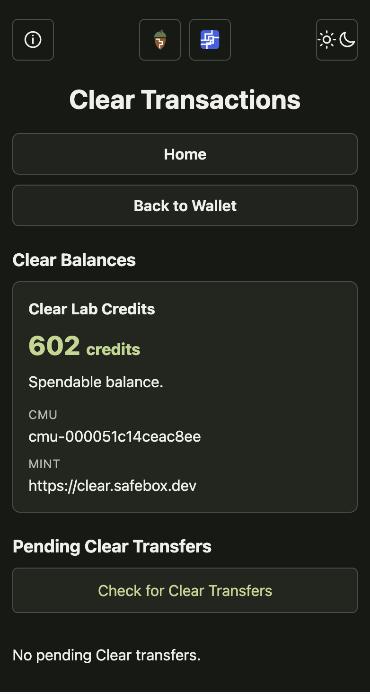

# Cash and Clear

Safebox Web can hold two kinds of value without pretending they are the same.

## Cash Balance

The singular **Cash Balance** contains sat-denominated funds from
Bitcoin- and Lightning-backed Cashu mints. It is used for payments and intended
to be broadly transferable.

Safebox distinguishes a pending cash payment from the spendable cash balance
until Acorn has completed the required mint checks.

## Clear Balances

The plural **Clear Balances** contain organization-issued credits. Each balance
belongs to one exact mint and Clear Mint Unit (CMU).

Examples may include:

- community food credits;
- member benefits;
- service or facility units;
- event allowances;
- local vouchers; and
- organization-defined reimbursements.

Clear activity is described as a transfer, not a cash payment. A transfer may
be an allocation, gift, benefit, exchange, or treasury disbursement under the
issuer's program.

<figure class="safebox-screen-figure" markdown>

<figcaption>The Clear Transactions screen keeps the readable alias, spendable amount, canonical CMU, and issuing mint together. Pending transfers remain visibly separate until they are accepted into the matching balance.</figcaption>
</figure>

## Why the balances stay separate

```text
Cash Balance
  9,836 sats

Clear Balances
  Clear Lab Credits: 100 credits
  Harbour Lab Credits: 25 smiles
```

The two Clear balances cannot be added together merely because both use Cashu
proofs. Their complete CMUs and mint URLs identify different issuers, policies,
and obligations.

Friendly aliases make balances readable. Canonical identifiers keep them
honest.

## Clear Transactions

A **Clear Transaction** moves units associated with one specific Clear Balance.
Its amount only has meaning together with the issuing mint and CMU. Safebox Web
therefore keeps Clear transaction activity out of Cash history and does not
combine activity from unrelated Clear balances.

The Clear Transactions page presents three distinct states:

- spendable units already held in each Clear Balance;
- pending transfers discovered on the relay; and
- completed Clear transaction history for that exact mint and CMU.

### Receiving a Clear transfer

A sender delivers a private kind `7379` Clear transfer to the NIP-05 address
associated with the wallet. On the Clear Transactions page, the recipient
selects **Check for Clear Transfers**.

Acorn retrieves and validates the encrypted transfer. Safebox Web then shows it
as pending under the correct Clear Balance.

Pending means the transfer arrived, not that it has already become spendable
Clear proof state. The user may retain it for future acceptance or delete it.
A deleted transfer does not return on the next relay check.

## A new organizational capability

This working flow means an organization can now:

1. operate a Clear mint;
2. define and name a keyset-bound CMU;
3. issue units into a treasury wallet;
4. send an exact amount to a person's address; and
5. let the person see and control the transfer beside their cash wallet.

The next stage is recipient acceptance and onward wallet spending. Until that
stage and security review are complete, Clear should be used only for test
units with no promise of financial value.

[Read the technical milestone](https://github.com/trbouma/safebox-web/blob/main/docs/CLEAR-TRANSFER-PRODUCT-MILESTONE-2026-08-17.md){ .md-button .md-button--primary }
[How Safebox treats funds](how-safebox-treats-funds.md){ .md-button }
[Project status](project-status.md){ .md-button }
