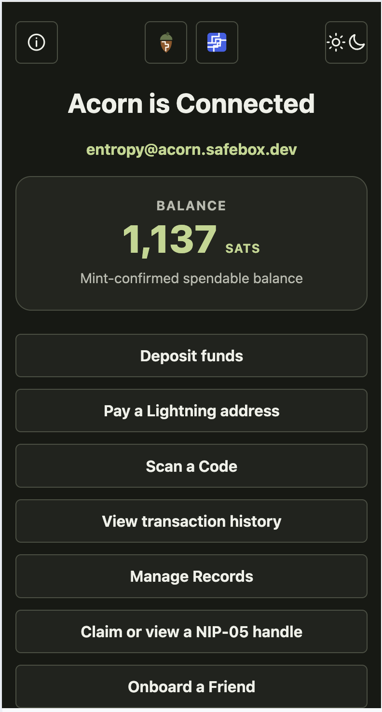

<section class="safebox-hero" markdown>

# Safebox Web

<p class="safebox-tagline">A local-first application for user-controlled value, verifiable records, and continuity.</p>

<p class="safebox-intro">Safebox Web brings Cash and Clear balances together with private, previewable Record Files while keeping value, evidence, and control portable across apps and infrastructure.</p>

<figure class="safebox-phone" markdown>
  <div class="safebox-phone-frame">
    <span class="safebox-phone-speaker" aria-hidden="true"></span>
    
  </div>
  <figcaption>Confirmed Cash and organization-issued Clear balances coexist in one wallet while remaining visibly distinct and independently accounted for.</figcaption>
</figure>

[Why Safebox Web?](why-safebox-web.md){ .md-button .md-button--primary }
[Radical Rewrite of Architecture](radical-rewrite-of-architecture.md){ .md-button .md-button--primary }
[View the source](https://github.com/trbouma/safebox-web){ .md-button }

</section>

## One wallet, three kinds of capability

Safebox Web gives people a practical place to create or connect a wallet,
hold private records, receive value, share evidence, and recover continuity
when surrounding services change.

Underneath the app is Acorn: the portable protocol state for keys, balances,
records, and recovery. The design keeps application convenience separate from
user authority, so Safebox Web can be replaced without replacing the wallet.

Safebox Web now makes a further distinction visible: one **Cash Balance** for
sat-denominated payments and plural **Clear Balances** for transfers of
organization-issued credits. The balances coexist in one wallet without being
summed or presented as interchangeable.

Balances and records are two practical views of one controlled-resource
model. Fungible proof records are aggregated within an exact equivalence
domain and displayed as a balance. Non-fungible records remain individually
visible because their content, provenance, and control history matter.

The same application can safeguard exact Record Files and present them
according to what they are. Apple Wallet passes, W3C Verifiable Credentials,
EUDI PIDs, and mobile driving licences can now receive semantic inline previews
without asking the underlying blob store to understand any of those formats.

| Capability | What Safebox shows | Where authority remains |
| --- | --- | --- |
| **Cash** | Mint-confirmed balance, pending arrivals, payments, and history | Cashu proofs, mint state, and the user's Acorn |
| **Clear** | Separate balances for organization-issued units and transfer history | The issuing organization, Clear mint, and CMU policy |
| **Verifiable Records** | Exact Record Files, effective type, semantic previews, and Record File Fingerprints | Native signature schemes, recognized issuers, attesters, and verifier policy |

[Understand Cash and Clear](cash-and-clear.md){ .md-button .md-button--primary }
[Explore verifiable records](records-and-wallet-passes.md){ .md-button .md-button--primary }

<section class="safebox-brand" markdown>


<p>Safebox Web is one interface for user-controlled balances, records, handles, and evidence.</p>

</section>

<div class="safebox-grid" markdown>

<article class="safebox-card" markdown>

### Connect

Create a new wallet or connect one you already control using recovery words or
a compatible private key.

</article>

<article class="safebox-card" markdown>

### Use

Work with Cash and Clear balances, relay-backed records, protected originals,
handles, payments, transaction history, and record sharing flows.

</article>

<article class="safebox-card" markdown>

### Verify

Preview PKPASS, W3C VC, EUDI PID, and mDL artifacts, then connect their Uniform
Digest Anchors to native verification or independent attestation and control
protocols.

</article>

<article class="safebox-card" markdown>

### Move

The wallet state remains portable. The app can be replaced without replacing
the controlled key, relay-backed records, or recovery path.

</article>

</div>

## Any artifact, one consistent record path

Safebox does not need one storage model per credential or document standard.
Every Record File follows the same path:

```text
exact original bytes
    -> encrypted blob storage
    -> Uniform Digest Anchor
    -> effective MIME resolution
    -> format-aware preview
    -> optional native verification
    -> optional attestation and control protocols
```

The current application has specialized previews for images, PDFs, Apple
Wallet passes, W3C Verifiable Credentials, EUDI PIDs, and ISO mobile driving
licences. Unknown formats still travel through the same encrypted preservation
and download path.

This lets a community add a control protocol that matches its own governance
without changing the artifact or taking over its native signature scheme.
OpenETR can bind provenance and control events to an exact digest. Another
community can define different attesters, lifecycle events, recognition rules,
or verifier policy over the same kind of anchor.

[See the complete record model](records-and-wallet-passes.md){ .md-button .md-button--primary }
[Understand Deep Verification](deep-verification.md){ .md-button }

## Check, Present, Share

Safebox turns graduated disclosure into three understandable record actions:

- **Check** opens the Control History and durable signed evidence without
  requiring disclosure of the private record.
- **Present** lets another person inspect the exact record temporarily without
  importing it.
- **Share** gives the recipient the exact record when retention or deep
  verification is justified.

The progression is deliberate: check the evidence first, present when the
decision requires the record, and share only when the recipient needs to keep
or analyze it.

[Explore Graduated Disclosure](graduated-disclosure.md){ .md-button .md-button--primary }

## Web-enabled but local-first under the hood

Safebox Web can feel like an ordinary web app: open it in a browser, use clear
screens, scan QR codes, and share records. Underneath, the important state is
not meant to belong to the web deployment.

Acorn publishes encrypted records through Nostr relays. A relay can store and
serve a signed event, but it does not become the authority over what the record
means. The authority that travels with the record is the cryptographic evidence
of who published it, who can decrypt it, and which later signed events refer to
it.

That lets records live anywhere suitable: a public relay, a community relay, a
private relay, or a local Spurline relay inside a Lockbox. The web app is a
convenient way to use the record. The record's continuity does not depend on
that one web app remaining online.

## Show arrival now, confirm spendability honestly

A payment does not need to disappear behind a spinner while every relay and
mint operation finishes. Safebox shows incoming transfers as pending as soon
as they are visible for the Acorn. Each arrival remains separate from the
confirmed balance until Acorn establishes that its proofs are compatible,
accepted by the mint, and safely persisted.

<div class="safebox-grid safebox-grid--two" markdown>

<article class="safebox-card" markdown>

### Arrival is visible

Relay evidence gives the user immediate assurance that a payment was sent to
their Acorn.

</article>

<article class="safebox-card" markdown>

### Spendability is earned

The large balance changes only after mint confirmation and Acorn's proof
compatibility checks.

</article>

<article class="safebox-card" markdown>

### Finalization can continue

Longer relay and mint work runs in the background. The user can return later
without losing sight of what arrived.

</article>

<article class="safebox-card" markdown>

### Coordination is not custody

Safebox stores non-secret job progress, not the recipient's key, proofs, or
private wallet state.

</article>

</div>

[See how Safebox treats funds](how-safebox-treats-funds.md){ .md-button .md-button--primary }

## Organization-issued value has reached the wallet

The current Clear milestone crosses the full delivery boundary:

```text
Clear mint
  -> clear-lab treasury
  -> NIP-05 discovery
  -> private kind 7379 transfer
  -> Acorn pending wallet state
  -> Safebox Web Clear Balance
```

The recipient can explicitly check the relay for Clear transfers, inspect the
mint and canonical CMU, use friendly program aliases, and delete a pending
transfer without having it return on the next scan.

This is still a lab milestone. Acceptance into spendable Clear proof state and
onward wallet spending remain under development.

[Read about Cash and Clear](cash-and-clear.md){ .md-button .md-button--primary }

## Part of the Mainstay product family

Safebox Web is an independently useful sibling in the Mainstay product family:

```text
Safebox Web -> Acorn -> Spurline
                      -> Grove

        practical foundation for
                 Mainstay
                    |
             Lockbox appliance
```

It is useful as a hosted or self-hosted web app today, and it is the practical
foundation for Mainstay, the future unified application. Lockbox is the
hardware-first appliance intended to run Mainstay and its supporting services
locally.

**Good boundaries, not barriers.** Safebox Web owns the human workflows, while
Acorn, Grove, Spurline, mints, and other services retain their own authority
and failure boundaries. Open protocols keep those boundaries interoperable so
the app can coordinate continuity without becoming the wallet, relay, mint, or
system of record.

<div class="safebox-family" markdown>

[**Acorn**  
Protocol authority for keys, records, recovery, and value.](https://github.com/trbouma/safebox-acorn)

[**Grove**  
Blossom storage for opaque, content-addressed blobs.](https://github.com/trbouma/grove)

[**Spurline**  
A local-first relay for individuals and communities.](https://github.com/trbouma/spurline)

[**Clear**<br>
Optional bounded local currencies for organizations and communities.](https://github.com/trbouma/clear)

[**Mainstay + Lockbox**<br>
The future unified app and its hardware-first local appliance.](product-architecture.md)

</div>

## Built for continuity

Safebox Web is deliberately server-rendered, dependency-aware, and modest in
what it asks the browser to do. The browser provides the session and
progressive interactions. Acorn performs wallet and record operations. Relays,
mints, Grove servers, and later local Lockbox services remain explicit
replaceable dependencies.

Safebox Web uses two simple payment signals. The large balance is
**mint-confirmed and spendable**. Incoming ecash from connected payment flows
and Continuity Payments can remain **pending** until the user finalizes them.
If a mint cannot be reached, the value stays pending rather than being
presented as final.

Continuity Payments extend that model into local commerce. Safebox can transfer
previously issued ecash directly to another Safebox address, including when
mint access is interrupted. The recipient does not need a different receiving
workflow: the payment appears as pending and can be finalized when the mint is
available again. This working experiment is an important foundation for
Mainstay across Connected, Local, Mobile, and Community modes.

[Read the radical rewrite](radical-rewrite-of-architecture.md){ .md-button .md-button--primary }
[See how Safebox treats funds](how-safebox-treats-funds.md){ .md-button .md-button--primary }
[Read the product architecture](product-architecture.md){ .md-button .md-button--primary }
[Get started](getting-started.md){ .md-button }
