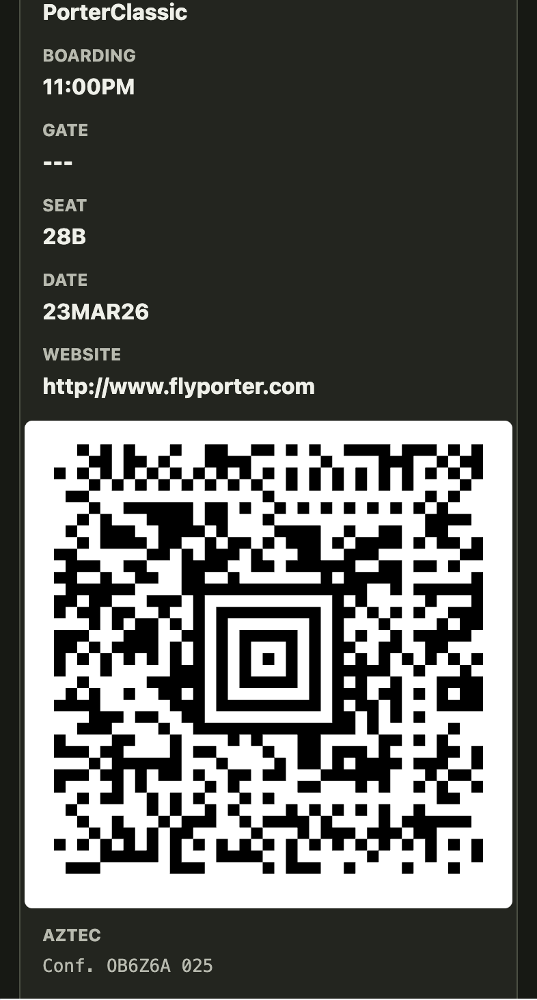
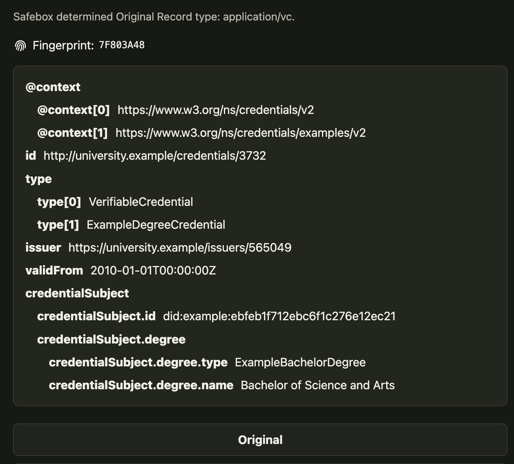
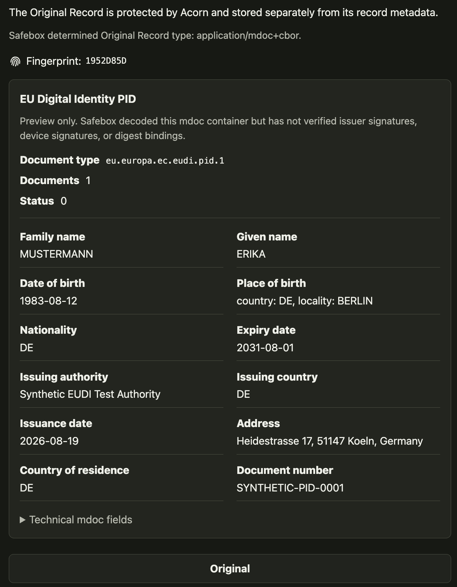
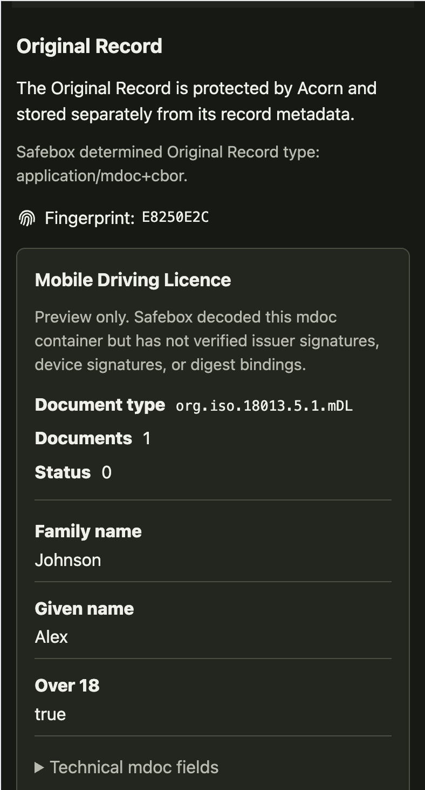

# Verifiable Records

Safebox Web can safeguard a private record together with its **Original
Record**: the exact artifact attached to it. The private record supplies human
context. Acorn preserves and retrieves the encrypted original. Safebox Web
chooses a useful presentation. Native verifiers and control protocols can then
add evidence without redefining the artifact.

This is a common pipeline for otherwise very different records:

| Record File | Effective MIME | Safebox Web presentation |
| --- | --- | --- |
| Image | `image/*` | Responsive inline image |
| PDF | `application/pdf` | Browser-compatible PDF viewer |
| Apple Wallet pass | `application/vnd.apple.pkpass` | Pass fields, artwork, QR or Aztec barcode, and wallet action |
| W3C Verifiable Credential | `application/vc` or `application/vp` | Nested credential fields with readable keys and values |
| EUDI PID | `application/mdoc+cbor` | Semantic PID identity fields with technical mdoc data available separately |
| ISO mobile driving licence | `application/mdoc+cbor` | Semantic mDL fields with technical mdoc data available separately |
| Other artifact | Resolved or declared type | Exact original download when no specialized preview is available |

## Format-aware at the edge, format-agnostic at the core

The upload resolver considers the filename, declared media type, and narrowly
defined format evidence to determine an **effective MIME**. That value tells
Safebox Web which presentation handler to use.

The storage path remains unopinionated:

```text
Record File bytes
    -> hashed and encrypted by Acorn
    -> stored by a Blossom-compatible server as opaque ciphertext
    -> authenticated, retrieved, and decrypted for the connected user
    -> interpreted by Safebox Web through effective MIME
```

Grove does not need a PKPASS parser, credential schema, CBOR decoder, or trust
registry. Regular blobs require no format-specific storage logic. New
presentation handlers can be added without changing the blob protocol.

## Uniform Digest Anchor

Every exact Record File can produce a **Uniform Digest Anchor (UDA)**:

```text
uniform_digest_anchor = sha256(exact_original_bytes)
```

Uniform means every format gets the same kind of exact-byte reference. It does
not mean that different renditions share a digest. A PDF conversion of a
credential and its original mdoc are different byte sequences with different
anchors.

The UDA allows otherwise independent evidence systems to agree on precisely
which artifact they concern:

```text
exact artifact
    -> Uniform Digest Anchor
       +-> native signature verification
       +-> issuer and status evidence
       +-> third-party attestations
       +-> provenance and control history
       +-> community verifier policy
```

The anchor proves byte equality. It does not prove truth, issuer authority,
validity, ownership, control, or legal effect.

## Current semantic previews

### Apple Wallet passes

PKPASS packages can be shown as the passes people recognize: issuing
organization, pass fields, artwork, serial information, and declared QR or
Aztec barcodes. Safebox preserves the original signed ZIP package and does not
rewrite or re-sign it.

<figure class="safebox-screen-figure" markdown>

<figcaption>A live boarding-pass preview rendered from a PKPASS Record File. Safebox presents the pass fields and generates the declared Aztec barcode from its encoded message while preserving the exact signed package for download and verification.</figcaption>
</figure>

### W3C Verifiable Credentials

JSON W3C credentials and presentations can be recognized from their credential
context and type. Safebox renders nested key-value data so a person can inspect
the claims without downloading a `.bin` file or reading raw JSON.

<figure class="safebox-screen-figure safebox-screen-figure--wide" markdown>

<figcaption>A live preview of the W3C example degree credential. Safebox identifies the credential, anchors its exact bytes with a Record File Fingerprint, and renders nested claims for inspection without claiming that the issuer proof, credential status, or holder presentation has been verified.</figcaption>
</figure>

### EUDI PID

An ISO mdoc with document type `eu.europa.ec.eudi.pid.1` receives a dedicated
PID view. Family name, given name, birth information, nationality, address,
document dates, and issuing details use human-readable labels. The underlying
technical CBOR structure remains available in a collapsed view.

<figure class="safebox-screen-figure safebox-screen-figure--wide" markdown>

<figcaption>A live preview of the synthetic EUDI PID fixture. Safebox identifies the mdoc, anchors the exact Record File with a Record File Fingerprint, and presents its identity attributes without claiming that the issuer signature, device signature, or digest bindings have been verified.</figcaption>
</figure>

### Mobile driving licences

An ISO mdoc with document type `org.iso.18013.5.1.mDL` receives the same
semantic treatment. Identity, licence, age, issuing, and driving-privilege
fields can be presented cleanly while preserving the exact original mdoc.

<figure class="safebox-screen-figure" markdown>

<figcaption>A live Safebox Web mDL preview. The application identifies the mdoc, anchors the exact Record File with a Record File Fingerprint, and presents useful identity fields without claiming that decoding has verified its signatures or digest bindings.</figcaption>
</figure>

Both PID and mDL views are explicitly marked **Preview only**. Decoding a
container is not verification of issuer signatures, device signatures, digest
bindings, status, or trust policy.

## Native verification stays native

Safebox does not flatten every standard into one pretend verification badge.

| Artifact | Native verification may include |
| --- | --- |
| PKPASS | Apple pass manifest, signature, certificate chain, and wallet trust behavior |
| W3C VC | Securing mechanism, issuer identity, credential status, holder proof, and verifier policy |
| EUDI PID or mDL | COSE signatures, MSO digest bindings, device authentication, trust lists, status, and presentation context |
| PDF | Embedded document signatures, certificate policy, timestamps, and revocation evidence |

Those mechanisms can be integrated through format-specific verifier adapters.
The Uniform Digest Anchor remains useful before, during, and after native
verification because it identifies the exact input evaluated.

## Independent attestation and control

A separate protocol can bind signed statements to the same anchor without
altering the Record File or claiming authority over its native scheme.

OpenETR is one example. It identifies an exact Digital Artifact, preserves
signed evidence concerning actions such as transfer, encumbrance, redemption,
or termination in a Digital Controllable Record, and derives consequential
state under defined rules.
Another community may care about inspection, archival custody, membership,
local issuance, professional endorsement, or a different control lifecycle.

```text
shared substrate: exact artifact + Uniform Digest Anchor

community A -> issuer trust and credential status
community B -> independent attestations and custody evidence
community C -> transferable control history
community D -> local recognition and acceptance policy
```

The substrate is common; authority and policy are not. Anyone may be able to
make an attestation. A verifier still decides whether the signer is recognized,
whether the statement is relevant and current, and what effect it should have.
Transferring protocol control of a digest-bound record also does not
automatically transfer legal ownership or modify the artifact's native holder
relationship.

This separation lets Safebox support many record communities without becoming
their universal schema owner, trust registry, or legal authority.

[Understand Deep Verification](deep-verification.md){ .md-button .md-button--primary }
[Read the PKPASS implementation note](https://github.com/trbouma/safebox-web/blob/main/docs/PKPASS-PREVIEW-FEATURE.md){ .md-button }
